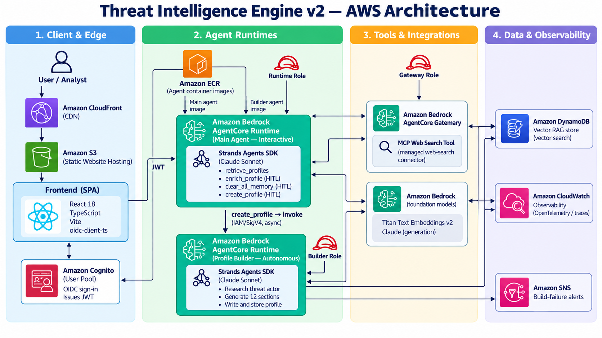
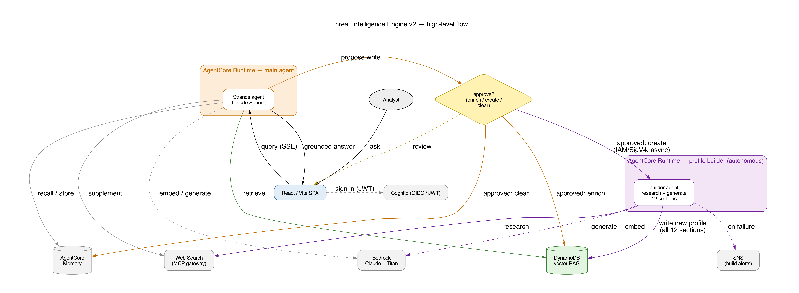
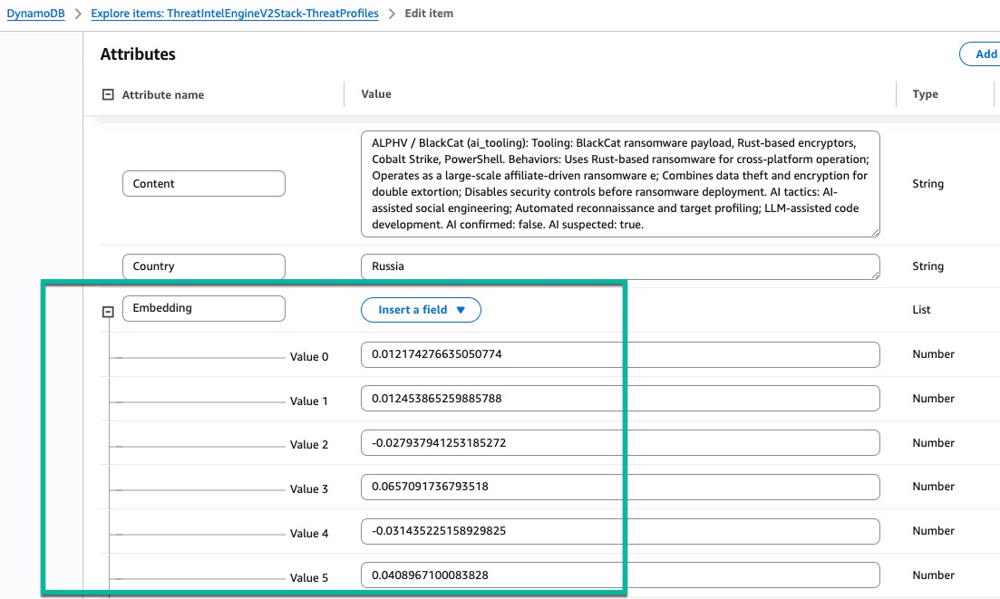
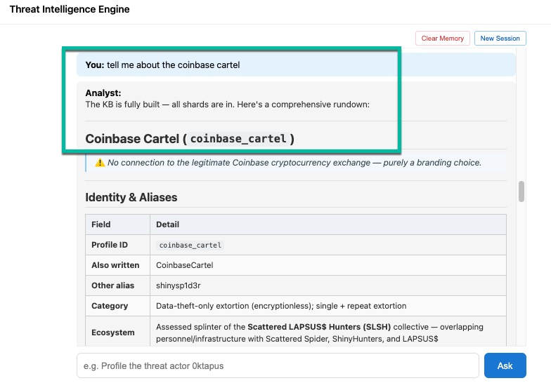
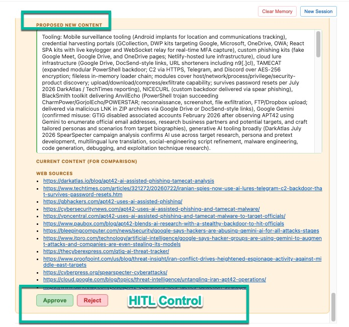
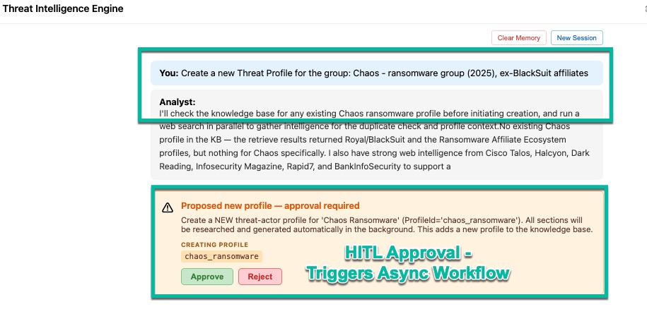
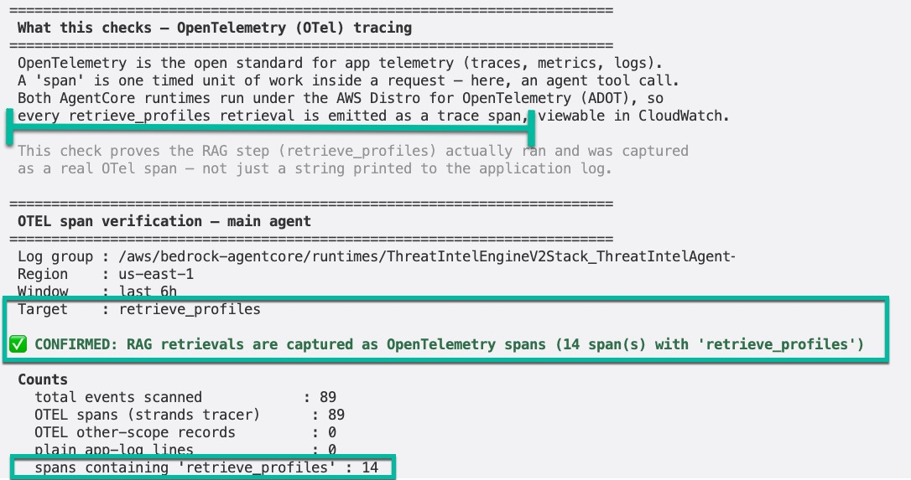

# Threat Intelligence Engine v2

A full-stack Retrieval-Augmented Generation (RAG) app for threat-actor research,
purple-team exercise design, and incident attribution. It is a rebuild of an earlier
version (v1) with a different retrieval store and a modern web stack.



> **Status:** implemented. This project was built spec-first
> (`requirements.md` → `design.md` → `tasks.md`). Post-deploy verification steps are in
> [`docs/INTEGRATION_VERIFICATION.md`](./docs/INTEGRATION_VERIFICATION.md).

> **⚠️ Demo / learning project.** This app uses **Amazon DynamoDB vector search** as its
> RAG store to learn the technology and to keep operational profile data and vectors in a
> single store. For this mostly-static, read-heavy threat-profile corpus, a managed Bedrock
> Knowledge Base on **S3 Vectors** (what v1 uses) is likely the more cost-effective and
> lower-maintenance **production** choice. See [`DECISIONS.md`](./DECISIONS.md).

> **💲 Costs.** Deploying this stack creates billable AWS resources (two AgentCore runtimes,
> Bedrock model calls, DynamoDB, CloudWatch/X-Ray with 100% trace indexing, etc.). See
> [`COST_ESTIMATE.md`](./COST_ESTIMATE.md) for an approximate, per-service breakdown and
> cost-control tips. All figures there are **rough and vary with usage** — verify against
> current AWS pricing and set an AWS Budget. Tear the stack down when you're not using it.

## What's different from v1

| Aspect | v1 | v2 |
|---|---|---|
| RAG store | Bedrock Knowledge Base + S3 Vectors | **DynamoDB vector search** |
| Retrieval | Managed KB `Retrieve` | Own embed-query + `SearchVectors` |
| Generation | Hand-rolled retrieve-then-generate | Agentic retrieve-then-generate (Strands) |
| Web search | none | **AgentCore managed Web Search** (MCP gateway) |
| Human-in-the-loop | none | **Approve profile enrichment** before write |
| UI | Streamlit | **React + TypeScript (Vite)** SPA |
| Backend | stdlib HTTP handler | **FastAPI + Strands** on AgentCore Runtime |
| Metadata | in S3 Vectors only | first-class **DynamoDB attributes** |

> For a consolidated, per-feature explanation of what improved and why (with source pointers), see [`ENHANCEMENTS.md`](./ENHANCEMENTS.md).

## Architecture (summary)

React/Vite SPA (Cognito OIDC) → `POST /invocations` on AgentCore Runtime → FastAPI + Strands
agent (Claude Sonnet 4.6). The agent's tools:



The diagram above traces one request end to end: the browser SPA signs the user in with
Cognito, POSTs their question to the runtime's `/invocations` endpoint, and the Strands agent
decides which tools to call — grounding in the DynamoDB vector store, optionally searching the
web, and writing back through the human-in-the-loop tools — before streaming a cited answer
back to the UI. The agent's tools:

- **`retrieve_profiles`** — embeds the query (Titan v2, 1024-dim) and runs `SearchVectors`
  over the DynamoDB vector index (COSINE, no HASH key, `FileType`/`Country` inline filters).
- **`WebSearch`** — the AgentCore managed web-search connector via an MCP gateway.
- **`enrich_profile`** — the HITL tool: researches an actor, drafts a profile update, and
  pauses for analyst approval before writing back and re-embedding.
- **`create_profile`** — the HITL tool to ADD a brand-new actor. It runs a variation-aware
  duplicate check, then (on approval) fire-and-forget invokes a separate autonomous **builder
  runtime** that researches + generates all 12 sections, embeds, and writes the profile in the
  background. See [`docs/CREATE_PROFILE_DESIGN.md`](./docs/CREATE_PROFILE_DESIGN.md).
- **`current_time`** — a small utility tool for time-relative reasoning.

Conversation continuity is backed by **AgentCore Memory** (short-term history plus
long-term facts and preferences). The agent is cached per session in-process so the same
instance that raised a HITL interrupt handles the approve/reject resume.

## Streaming: where SSE is used (and where it isn't)

The app streams in one direction and stays synchronous in the other, on purpose.

**Answer generation → Server-Sent Events (SSE).** When the agent generates an answer, the
runtime returns a `text/event-stream` and pushes each incremental text delta as its own
frame, so the analyst sees the response build token-by-token instead of waiting for the whole
thing. The stream carries a small set of typed events and always ends with exactly one
terminal frame:

- `{"content": "..."}` — an incremental text delta (appended to the current message)
- `{"tool_running": "enrich_profile", "notice": "..."}` — a transient "working…" hint while a
  slow tool runs
- `{"pending_approval": true, "interrupts": [...]}` — terminal: the agent hit a
  human-in-the-loop interrupt and is waiting for approval
- `{"done": true}` — terminal: the answer finished normally
- `{"error": "..."}` — terminal: something failed, surfaced inline

*Why SSE here:* generation is a long, one-way server→client push. SSE is the simplest fit —
plain HTTP, no extra protocol, no bidirectional socket to manage — which is why we didn't
reach for WebSockets.

**HITL approve/reject → plain synchronous POST (no streaming).** When the analyst approves or
rejects a proposed enrichment, the frontend sends a normal JSON `POST` to the same
`/invocations` endpoint and waits for a single JSON response. *Why not SSE:* an approve/reject
is one discrete decision with one result — there's nothing to stream, so a request/response
round-trip keeps the contract simple.

**What makes it work:**

- *Backend* — FastAPI's `StreamingResponse` with `media_type="text/event-stream"`, fed by an
  async generator (`stream_agent_response`) that iterates the Strands agent's `stream_async`
  and formats each event as a `data: {json}\n\n` frame. On AgentCore Runtime, served by
  uvicorn.
- *Frontend* — **React 18 + TypeScript** on **Vite**. The client reads the stream with the
  `fetch` API and a `ReadableStream` reader (`response.body.getReader()` + `TextDecoder`),
  parsing frames as they arrive — not `EventSource`, because the request is a `POST` with an
  auth header, which `EventSource` can't send. Deltas are coalesced in a ~30ms buffer so the
  UI updates smoothly rather than re-rendering per token, and each update is re-rendered as
  GitHub-Flavored Markdown via **react-markdown** + **remark-gfm** (which tolerate incomplete
  mid-stream markdown). Auth is **Cognito OIDC** via **oidc-client-ts**.

## Data model (summary)

- **Table `ThreatProfilesV2`** — `PAY_PER_REQUEST`, key `(ProfileId, ShardId)`.
- **One item per shard.** Each actor's ~11 `file_type` shards (from `threat-profiles/`)
  becomes its own item with its own 1024-dim embedding — e.g. the 12 `0ktapus_*` files
  become 12 items under `ProfileId="0ktapus"`.
- **Vector index `profile-embeddings`** — no HASH key (search spans all shards), with
  `FileType` and `Country` as `INLINE_FILTER`s for optional scoping.

Each shard is a DynamoDB item carrying its own 1024-dim Titan v2 embedding alongside its
keys and metadata:



The four read/write flows — seed ingestion, retrieval, HITL enrichment, and autonomous
new-profile creation — all share this one vector store:


The diagram above shows all four paths converging on the single `ThreatProfilesV2` table.
Every write embeds with the same Titan v2 model that retrieval embeds queries with, so stored
and query vectors always live in the same space:

- **Seed ingestion (write)** — the loader walks the `threat-profiles/` corpus, embeds each
  shard, and upserts all items (see `loader/load_profiles.py`).
- **Retrieval (read)** — `retrieve_profiles` embeds the analyst's query and runs
  `SearchVectors` to pull the nearest shards as grounding context.
- **HITL enrichment (write)** — `enrich_profile` researches an actor, and on analyst approval
  overwrites a shard's content and re-embeds it in place.
- **Autonomous creation (write)** — for a brand-new actor, the builder runtime generates all
  12 sections, embeds them, and writes the whole profile in one batch.

Retrieval reads what the other three flows write — there's no separate index to keep in sync,
because the vector index is derived from the table itself.

## How embedding, search, and retrieval work

The whole RAG path is three steps: embed text into a vector, run a DynamoDB
`SearchVectors` query with that vector, then parse the ranked matches back into a grounding
context. The snippets below are the actual implementation (lightly trimmed of docstrings for
readability).

**1. Generate the embedding** — the same `embed_text` is used at ingestion time (to embed
each shard) and at query time (to embed the analyst's question), so stored vectors and query
vectors are always produced identically ([`agent/src/embeddings.py`](./agent/src/embeddings.py)):

```python
def embed_text(text: str) -> list[float]:
    if not text or not text.strip():
        raise ValueError("embed_text requires non-empty text.")

    body = json.dumps({"inputText": text, "dimensions": EMBEDDING_DIMENSIONS})
    response = _bedrock_client().invoke_model(modelId=EMBEDDING_MODEL, body=body)
    payload = json.loads(response["body"].read())
    embedding = payload["embedding"]

    if len(embedding) != EMBEDDING_DIMENSIONS:
        raise ValueError(
            f"Titan returned a {len(embedding)}-dim embedding but "
            f"{EMBEDDING_DIMENSIONS} was requested; check EMBEDDING_MODEL / "
            "EMBEDDING_DIMENSIONS and the vector index Dimensions."
        )

    return [float(value) for value in embedding]
```

**2. Search the vector index** — the `retrieve_profiles` tool embeds the query, builds a
`SearchVectors` request (Top-K nearest shards, optional `FileType`/`Country` inline filters),
runs it, then keeps only matches within the COSINE relevance threshold
([`agent/src/tools/retrieval_tools.py`](./agent/src/tools/retrieval_tools.py)):

```python
@tool
def retrieve_profiles(
    query: str,
    top_k: int = DEFAULT_TOP_K,
    file_type: str | None = None,
    country: str | None = None,
) -> str:
    clamped_top_k = max(MIN_TOP_K, min(top_k, MAX_TOP_K))

    request: dict[str, Any] = {
        "TableName": DDB_TABLE_NAME,
        "IndexName": DDB_VECTOR_INDEX,
        "SearchVector": to_vector_attr(embed_text(query)),   # embed → vector
        "TopK": clamped_top_k,
        "ProjectionExpression": "#pid, #nm, #ft, #ct",
        "ExpressionAttributeNames": {
            "#pid": "ProfileId",
            "#nm": "Name",
            "#ft": "FileType",
            "#ct": "Content",
        },
    }

    condition = build_search_condition(file_type=file_type, country=country)
    if condition:
        request["SearchConditionExpression"] = condition["SearchConditionExpression"]
        request["ExpressionAttributeNames"].update(condition["ExpressionAttributeNames"])
        request["ExpressionAttributeValues"] = condition["ExpressionAttributeValues"]

    response = _search_vectors_with_retry(request)     # calls dynamodb.search_vectors
    results = from_search_results(response)            # parse SearchResults
    relevant = filter_by_threshold(results)            # drop far matches
    return _format_context(relevant)                   # citation-tagged context block
```

**3. Retrieve / parse the matches** — `SearchVectors` returns its hits under
`SearchResults` (each `{"Item": {...}, "Score": <cosine distance>}`), which `from_search_results`
flattens into citation-ready dicts. Note the vector goes in as a **bare** number list, not the
`{"L": [...]}` wrapper used elsewhere in the DynamoDB API ([`agent/src/ddb.py`](./agent/src/ddb.py)):

```python
def to_vector_attr(vector: list[float]) -> list[dict[str, str]]:
    # SearchVector expects [{"N": "0.1"}, ...] — NOT {"L": [...]}.
    if not vector:
        raise ValueError("to_vector_attr requires a non-empty vector.")
    return [{"N": str(component)} for component in vector]


def from_search_results(response: dict[str, Any]) -> list[dict[str, Any]]:
    results: list[dict[str, Any]] = []
    for match in response.get("SearchResults", []):     # not "Items"
        item = match.get("Item")
        if not item:
            continue
        results.append(
            {
                "ProfileId": _s(item, "ProfileId"),
                "Name": _s(item, "Name"),
                "FileType": _s(item, "FileType"),
                "Content": _s(item, "Content"),
                "Score": match.get("Score"),             # COSINE distance; lower = closer
            }
        )
    return results
```

## Web search via AgentCore Gateway (MCP)

Vector retrieval grounds answers in the curated corpus; **web search** covers what the
static corpus can't — recent campaigns, fresh CVEs, breaking reporting. It's the one
capability this app reaches for over **MCP** (Model Context Protocol), and it's provided by
**AWS's managed Web Search connector**, exposed through an **AgentCore Gateway**. We don't run
or host a search backend — the gateway fronts the built-in `web-search` connector and the
agent calls it as an MCP tool.

**What the gateway is (from `cfn/template.yaml`):** a single MCP gateway with IAM (SigV4)
inbound auth, plus one target pointing at the managed connector. That's the entirety of what
MCP / the gateway is used for here — there are no other MCP tools or targets.

```yaml
WebSearchGateway:
  Type: AWS::BedrockAgentCore::Gateway
  Properties:
    Name: !Sub "${AWS::StackName}-WebSearch"
    ProtocolType: MCP
    AuthorizerType: AWS_IAM          # callers sign requests with their runtime role
    RoleArn: !GetAtt GatewayServiceRole.Arn

WebSearchTarget:
  Type: AWS::BedrockAgentCore::GatewayTarget
  Properties:
    GatewayIdentifier: !GetAtt WebSearchGateway.GatewayIdentifier
    Name: web-search-tool
    TargetConfiguration:
      Mcp:
        Connector:
          Source:
            ConnectorId: web-search   # AWS-managed built-in connector
          Configurations:
            - Name: WebSearch
              ParameterValues: {}
```

**How the agent connects (from [`agent/src/agentcore_app.py`](./agent/src/agentcore_app.py)):**
a Strands `MCPClient` over an IAM-signed streamable-HTTP transport. The gateway URL is
injected by the stack (`AGENTCORE_GATEWAY_URL`), and requests are SigV4-signed for service
`bedrock-agentcore` using the runtime's own execution role — no API keys or tokens to manage:

```python
return MCPClient(
    lambda: aws_iam_streamablehttp_client(
        endpoint=gateway_url,
        aws_region=AWS_REGION,
        aws_service="bedrock-agentcore",
    )
)
```

**Authorization** is pure IAM: the gateway's service role is allowed
`bedrock-agentcore:InvokeWebSearch` on `web-search.v1`, and each runtime role is granted
`bedrock-agentcore:InvokeGateway` on the specific gateway. Nothing is callable anonymously.

**Who uses it — both runtimes:**

- **Main agent** — the model calls `WebSearch` to *supplement* the knowledge base. The system
  prompt tells it to `retrieve_profiles` **first**, and reach for the web only when retrieval
  returns `NO_RELEVANT_CONTEXT` / thin shards, or when the analyst explicitly asks for current
  info. Web sources are cited separately from knowledge-base citations.
- **Builder runtime** — the autonomous profile-builder uses the same gateway to web-research
  each of the 12 sections it generates for a brand-new actor.

**Graceful degradation.** Web search is treated as optional, not load-bearing. If
`AGENTCORE_GATEWAY_URL` is unset (e.g. local dev) or the MCP client can't be constructed, the
agent is still built with the local tools only and answers from the knowledge base — it just
notes that web results were unavailable. Because the Strands `MCPClient` connects lazily,
transient failures at call time are handled the same way: the model falls back to the corpus
and says so, rather than failing the request.

## Layout

```
agentcore-threat-intel-engine-v2/
├── agent/                        # FastAPI + Strands agent on AgentCore Runtime
│   ├── src/
│   │   ├── config.py             # env-var configuration (region, table, models, gateway, memory)
│   │   ├── embeddings.py         # Titan v2 embed_text() + boto3 search_vectors guard
│   │   ├── ddb.py                # DynamoDB clients + SearchVectors request/response helpers
│   │   ├── agentcore_app.py      # /invocations (SSE + HITL resume), /ping, agent factory
│   │   └── tools/
│   │       ├── retrieval_tools.py  # retrieve_profiles (DynamoDB vector search)
│   │       └── enrich_tools.py     # enrich_profile HITL tool + write-back
│   ├── tests/                    # unit + e2e tests
│   └── Dockerfile                # ARM64, uvicorn :8080
├── frontend/                     # React + TypeScript (Vite) SPA with HITL approval UI
│   └── src/{main,App,Chat}.tsx, auth.ts
├── loader/                       # threat-profile → DynamoDB embedding loader
│   ├── content.py                # per-file_type Content derivation + metadata mapping
│   ├── load_profiles.py          # walk profiles, embed, BatchWriteItem (idempotent, --limit)
│   └── tests/
├── cfn/template.yaml             # table + vector index, runtime, gateway, memory, auth, hosting
├── scripts/                      # integration_verify.py + offline tests
├── docs/INTEGRATION_VERIFICATION.md
├── deploy.sh                     # one-command deploy (region guard → ECR → CFN → load → frontend)
├── README.md
└── DECISIONS.md
```

## Prerequisites

- **Region: `us-east-1`** — required by the AgentCore managed Web Search connector.
  `deploy.sh` exits if the region is not `us-east-1`.
- **AWS account + credentials** with the [AWS CLI](https://aws.amazon.com/cli/) configured,
  and Amazon Bedrock model access to **Claude Sonnet 4.6** (`us.anthropic.claude-sonnet-4-6`)
  and **Titan Text Embeddings v2** (`amazon.titan-embed-text-v2:0`).
- **Docker** (for the ARM64 agent image — AgentCore Runtime is ARM64-only).
- **Node 18+ / npm** (the frontend targets React 18 + Vite 5).
- **Python 3.12 + [`uv`](https://docs.astral.sh/uv/)** (the agent and loader are `uv`
  projects; `deploy.sh` prefers `uv` to isolate dependencies).
- A recent **boto3** with the DynamoDB `search_vectors` API (>= 1.43.88); resolved inside the
  project venvs by `uv`.

## Deploy

```bash
cd agentcore-threat-intel-engine-v2
./deploy.sh
```

`deploy.sh` will (fail fast on any step): verify the region is `us-east-1` (region guard runs
first), build/push the ARM64 agent image to ECR, deploy the CloudFormation stack (DynamoDB
vector table, AgentCore Runtime/Memory/Gateway, Cognito, S3 + CloudFront hosting), **run the
loader** to embed and store the threat-profile shards, build and upload the frontend, and
print the frontend URL plus key resource identifiers.

Configurable via environment variables:

| Env var | Default | Purpose |
|---|---|---|
| `STACK_NAME` | `ThreatIntelEngineV2Stack` | CloudFormation stack name (also derives the ECR repo). |
| `ADMIN_EMAIL` | *(unset)* | Seeds an initial Cognito admin user (emailed a temp password). |
| `LOAD_LIMIT` | *(unset)* | Load only the first N shards — use for a fast subset deploy. |
| `SKIP_LOAD` | *(unset)* | Force-skip the corpus load unconditionally. |
| `FORCE_LOAD` | *(unset)* | Re-seed the corpus **even if the table already has data**. ⚠️ Overwrites seed shards, reverting any enrichments made to them. |
| `IMAGE_TAG` | *(git sha / timestamp)* | Immutable image tag for the build. Defaults to `git-<sha>` (or a UTC timestamp); **`latest` is rejected**. |
| `BEDROCK_MODEL_ID` | `us.anthropic.claude-sonnet-4-6` | Generation model id. |
| `THREAT_PROFILES_DIR` | *(loader default)* | Override the source `threat-profiles/` location. |

**Data safety on redeploy:** the corpus load **auto-skips when the table already has data**,
so re-running `./deploy.sh` will **not** overwrite your enrichments or agent-created profiles.
The load only runs on a fresh/empty table, or when you explicitly set `FORCE_LOAD=1`.

```bash
# Example: subset deploy with an admin user
LOAD_LIMIT=25 ADMIN_EMAIL=you@example.com ./deploy.sh
```

## Run / verify

- **Open the app:** browse to the CloudFront URL printed at the end of `deploy.sh` and sign
  in with Cognito (if you set `ADMIN_EMAIL`, use that user and the temporary password from the
  invite email).
- **Post-deploy verification:** follow
  [`docs/INTEGRATION_VERIFICATION.md`](./docs/INTEGRATION_VERIFICATION.md) — it polls the
  vector index until it is queryable, asserts semantic ranking on known queries, checks loader
  idempotency, and walks the enrich HITL round-trip. The scripted checks live in
  `scripts/integration_verify.py`.

Example prompts once you are in the chat:

- **Profile an actor:** "Profile the 0ktapus campaign — what are its TTPs and how do we detect it?"
- **Purple-team:** "Design a purple-team exercise for a ransomware-as-a-service group targeting cloud."
- **Enrich (HITL):** "Update APT29's detection profile with recent reporting." The agent
  drafts a change and asks you to **Approve** or **Reject**; on approval the shard is updated
  in place and re-embedded.
- **Create (HITL):** "Add a new profile for the Volt Typhoon threat actor." The agent checks
  it doesn't already exist (catching name variations), asks you to **Approve**, then builds
  the full profile in the background — search for the actor again a few minutes later. If the
  actor already exists it declines and points you to enrichment instead.

### Screenshots

A grounded, cited answer rendered as Markdown while it streams:



Every write is human-gated — the analyst approves or rejects a proposed enrichment (with its
web sources) before anything is written and re-embedded:



Adding a brand-new actor: on approval, the work is handed to the autonomous builder runtime,
which researches and generates all sections in the background:



## Observability (traces / RAG confirmation)

The agent is instrumented with **ADOT** (AWS Distro for OpenTelemetry) via
`opentelemetry-instrument` in the agent `Dockerfile`. On AgentCore Runtime the platform
**injects the OTLP export destination automatically** — the Dockerfile only selects the ADOT
distro/configurator (`OTEL_PYTHON_DISTRO=aws_distro`, `OTEL_PYTHON_CONFIGURATOR=aws_configurator`)
and lets the platform own the endpoint, protocol, and resource attributes.

This deployment uses **unified telemetry** (ADOT >= 0.18.0, agents created on/after 2026-07-20).
That means **spans go to the agent's own CloudWatch log group**, NOT the shared `aws/spans`
log group. Looking in `aws/spans` and finding "log group does not exist" is **expected** under
unified telemetry and is **not** an error.

`deploy.sh` enables CloudWatch **Transaction Search** (account-wide) and sets **100% X-Ray
trace indexing**. After first enablement, spans can take up to **~10 minutes** to appear in the
GenAI Observability dashboard.

**Console path:** CloudWatch → GenAI Observability → select the agent → **Traces** tab → open a
trace to see the `retrieve_profiles` span (proof the agent used RAG).



### One-command check (recommended)

[`scripts/verify_otel_rag.py`](./scripts/verify_otel_rag.py) wraps the checks below and prints a
friendly verdict. It only counts genuine OpenTelemetry **spans** (records with
`telemetry.sdk.name=opentelemetry` + `scope=strands.telemetry.tracer` + a valid `traceId`/`spanId`)
— not lines that merely contain the `retrieve_profiles` substring — so it proves you're seeing OTEL
data, not plain app logs. It auto-resolves the runtime log group from the stack's `RuntimeArn`.

```bash
AWS_REGION=us-east-1 python scripts/verify_otel_rag.py --stack-name ThreatIntelEngineV2Stack --hours 6
```

Run without `--agent` in a terminal and it shows a **menu** to pick which runtime's OTEL logs
to inspect. There are two runtimes, so choose with `--agent`:

- `--agent main` — the interactive threat-intel agent (calls `retrieve_profiles`).
- `--agent builder` — the autonomous profile-builder runtime (from the create-profile
  feature; it does not call `retrieve_profiles`, so a "spans present, tool not seen" result is
  the expected healthy state for it).
- `--agent all` — inspect both, one report each.

```bash
# just the builder, no prompt
python scripts/verify_otel_rag.py --agent builder --stack-name ThreatIntelEngineV2Stack
# both runtimes, machine-readable
python scripts/verify_otel_rag.py --agent all --json --stack-name ThreatIntelEngineV2Stack
```

Exit code `0` = a target-tool span was confirmed, `2` = OTEL spans present but the tool wasn't
seen (or nothing to confirm), `1` = operational error (e.g. log group not found).
Other useful flags: `--log-group` / `--runtime-arn` (skip the CFN lookup, single runtime),
`--no-menu` (skip the prompt, inspect all), `--tool` (default `retrieve_profiles`),
`--json`, `--no-compare`.

### CLI spot-checks

> **zsh note:** the `[` `]` in log-group / query arguments are treated as filename globs by zsh,
> so the examples below wrap the commands in `setopt noglob` / `unsetopt noglob`. **bash** users
> can omit those lines.

The runtime log group is named `/aws/bedrock-agentcore/runtimes/<RuntimeId>-DEFAULT`, where
`<RuntimeId>` comes from the stack's `RuntimeArn` output. Resolve it:

```bash
# Resolve the agent runtime log group from the stack
RUNTIME_ARN=$(aws cloudformation describe-stacks --stack-name ThreatIntelEngineV2Stack \
  --region us-east-1 --query "Stacks[0].Outputs[?OutputKey=='RuntimeArn'].OutputValue" --output text)
RUNTIME_ID=${RUNTIME_ARN##*/}
LG="/aws/bedrock-agentcore/runtimes/${RUNTIME_ID}-DEFAULT"
echo "$LG"
```

**Verified count (definitive check).** This counts events over the last 6h that contain BOTH the
OTEL span scope `strands.telemetry.tracer` AND the `retrieve_profiles` tool name, so a non-zero
count proves OTEL captured a RAG retrieval:

```bash
setopt noglob   # zsh only; bash users skip this line
START=$(( ($(date +%s) - 21600) * 1000 ))   # last 6 hours, epoch ms
aws logs filter-log-events --log-group-name "$LG" --region us-east-1 --start-time "$START" \
  --filter-pattern "strands.telemetry.tracer retrieve_profiles" \
  --query "length(events)" --output text
unsetopt noglob
```

A returned number **> 0** confirms the agent called `retrieve_profiles` (RAG) and OpenTelemetry
captured it as a span. (CloudWatch's space-separated filter pattern requires BOTH terms in the
same event.)

**Quick tail-based spot-check** to eyeball recent retrievals:

```bash
setopt noglob   # zsh only
aws logs tail "$LG" --region us-east-1 --since 6h --format short | grep -o 'retrieve_profiles' | head
unsetopt noglob
```

### Troubleshooting

- **`Failed to export span batch code: 400`** in the runtime logs points to conflicting
  hardcoded OTEL env vars in the Dockerfile. The Dockerfile should set **ONLY**
  `OTEL_PYTHON_DISTRO=aws_distro` and `OTEL_PYTHON_CONFIGURATOR=aws_configurator` and let
  AgentCore inject the endpoint / protocol / resource attributes.
- **`Failed to export logs batch code: 400 ... Upload too large ... exceeds 1048576`** means a
  telemetry record breached CloudWatch's 1 MB limit — the ADOT GenAI instrumentation was
  capturing the full model prompt/completion (large for RAG answers and generated profile
  sections). The Dockerfiles set `OTEL_INSTRUMENTATION_GENAI_CAPTURE_MESSAGE_CONTENT=NO_CONTENT`
  to stop capturing message bodies. Traces still carry tool names (e.g. `retrieve_profiles`),
  token counts, and latency — so the `verify_otel_rag.py` verdict still works — but the tool
  **input query text is no longer embedded in the span** (it's in the app logs if you need it).
- **Nothing in `aws/spans`** is expected under unified telemetry — use the agent's own runtime
  log group (resolved above) instead.

## Testing

Run each suite from within its project directory (pytest reads that project's
`pyproject.toml` for the `pythonpath`/`testpaths` config):

```bash
# Agent unit + e2e tests (retrieval, ddb helpers, enrich, retrieve-then-generate, web-search wiring)
cd agent && uv run pytest && cd ..

# Loader unit tests (content derivation per file_type, item mapping, idempotency)
cd loader && uv run pytest && cd ..

# Frontend type-check + build
cd frontend && npm install && npm run build && cd ..
```
